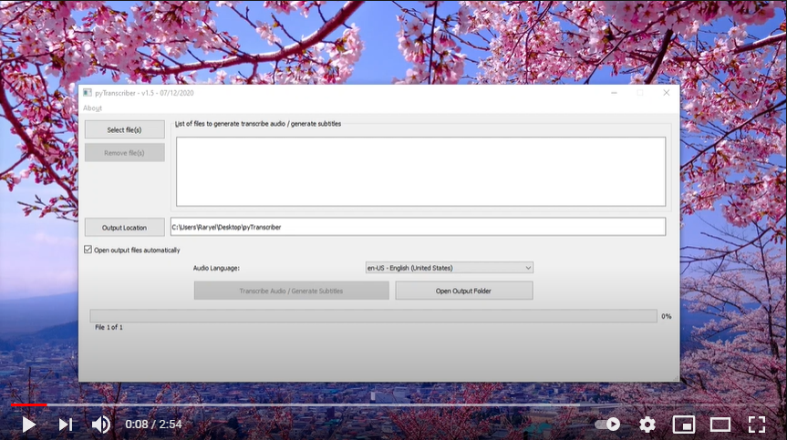

# pyTranscriber
[简体中文版本说明](README.md)

pyTranscriber 是一个可用于通过友好的图形用户界面为音频/视频文件生成<b>自动转录/自动字幕</b>的应用程序。语音识别的艰巨工作使用了基于 <a href="https://cloud.google.com/speech/">Google Speech Recognition API</a>的<a href="https://github.com /agemanidis/autosub">Autosub</a>.
 
 

 

## 中文版提交细节

2021/08/08 增加了一个代理配置的UI页面和代理配置逻辑,当前配置的代理只支持socks5协议.

### License

GPL v3
